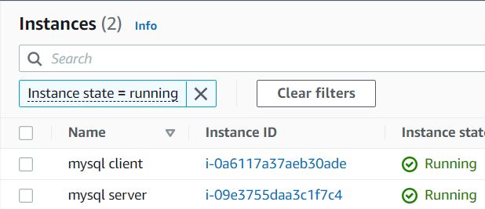

# Project 5 - Client-Server Architecture with MySQL
**Step 1 - Set up Linux instances**
---

- Set up two Linux EC2 instances. One for the server `mysql server` & `mysql client`.

**Step 2 - Install MySQL Server Software**
---

- Before installing the server software on the instance, the server needs to be updated. Ran `sudo apt update` & `sudo apt upgrade`.

- After the update and upgrade completes, run `sudo apt install mysql-server` to install the server application on the Linux instance.

- Next, run `sudo mysql_secure_installation` to add extra security to the installed MySQL server.

- Lastly, run `sudo systemctl restart mysql` to restart MySQL to activate config.

**Step 3 - Install MySQL Client Software**
---

- Before installing the client software on the instance, the server needs to be updated as well. Ran `sudo apt update` & `sudo apt upgrade`. After those are completed, run `sudo apt install mysql-client`.

**Step 4 - Configure NSG For Communication**
---

- The server machine needs to be configured to allow inbound traffic from the client when it is attempting to connect remotely. The port for MySQL server is `TCP 3306`, which has been opened to allow access from the client machine's local IP address.

**Step 5 - Set Up Remote User On Server For Client To Connect With**
---

- We would need to create a user account for anyone who would want to access the server remotely without using SSH. Without an account, they wouldn't be able to connect.

    - Run `sudo mysql` to start MySQL on the server machine.

    - Run the following code to create a user and the IP they would be connecting from with a password for security. `CREATE USER '<user>'@'<localhost>' IDENTIFIED BY '<password>';`

    - Run the following to grant the necessary permissions to the created user `GRANT ALL ON *.* TO '<user>'@'<localhost>';`. The * is a wildcard that selects all the available databases on the server. You can indicate what database needs to be accesible to the user.

    - Run `FLUSH PRIVILEGES;` to save permission configuration.
    

- We need to declare/bind what IP address would be allowed to connect to the server.

    - Run `sudo nano /etc/mysql/mysql.conf.d/mysqld.cnf` to edit the configuration file. When the config file is opened up, look for the `bind-address` line and add the address that would be bound to the server. For this demo, 127.0.0.1 was changed to 0.0.0.0 to allow access from any location but should NOT be used in prod.
    

    - Next, run `sudo systemctl restart mysql` to restart MySQL to activate config.

**Step 6 - Connect From Client to Server Remotely**
---

- On the client server, run `sudo mysql -u <user> -h <localIPaddress> -p`. After this, you will be prompted to put in the password that was setup earlier.

- Run the `show databases;` command to confirm the created user had necessary access and privileges. See output below:

**Project Successfully Completed!**